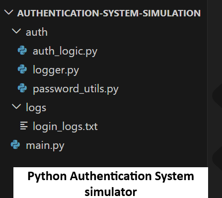
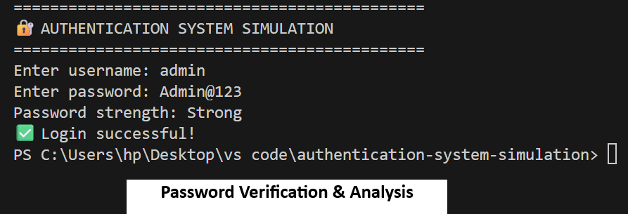
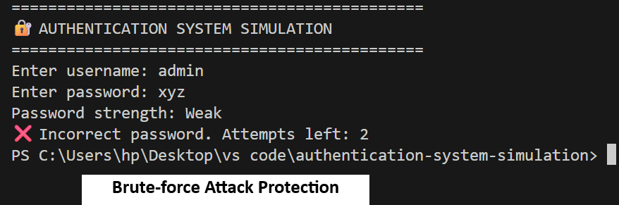
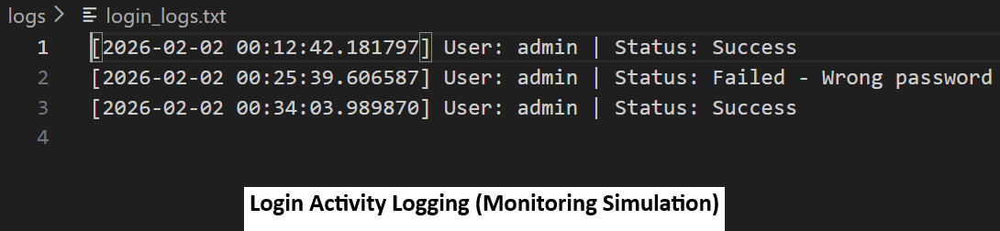

# Python Authentication System Simulation

A Python-based authentication system simulation demonstrating secure login handling, password hashing, brute-force protection, and activity logging.

---

## 🧠 Overview

This project simulates a secure authentication system similar to real-world applications. It demonstrates fundamental security concepts used in access control and secure login systems.

---

## ✨ Features

✔ Multi-user login  
✔ Brute-force protection with account lockout  
✔ Password hashing (SHA-256)  
✔ Password strength validation  
✔ Timestamp-based login activity logging  

> 🔐 **Security Tip:** In production systems, stronger hashing algorithms like **bcrypt** or **Argon2** with salts should be used.

---

## 📸 Demo Screenshots

| | |
|---|---|
| **Project Structure** | **Successful Login** |
|  |  |
| **Failed Attempts / Lockout** | **Login Logs** |
|  |  |

---

## 🛠️ Tech Stack

- Python 3.x  
- `hashlib` for password hashing  
- Modular design:
  - `auth_logic`
  - `password_utils`
  - `logger`

---

## 📦 Installation & Run

```bash
git clone https://github.com/NJ024/authentication-system-simulation.git
cd authentication-system-simulation
pip install -r requirements.txt
python main.py
